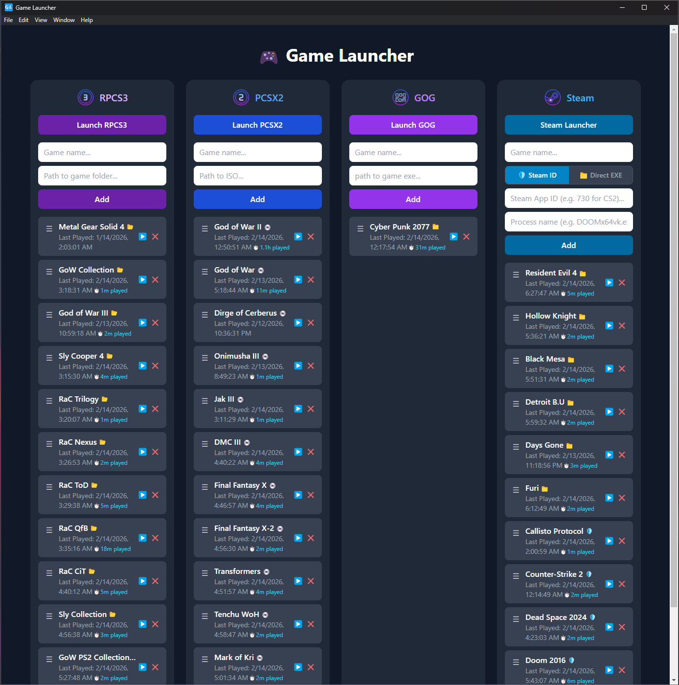

# 🎮 Game Launcher

A lightweight desktop application that brings your game library and emulators under one roof.



## Overview

Game Launcher is an Electron + React application that lets you manage and launch games across multiple platforms from a single, clean interface.

**Supported Platforms**
- RPCS3 (PS3 Emulator)
- PCSX2 (PS2 Emulator)
- GOG
- Steam

## Features

- Launch emulators and game clients directly from the app
- Add and manage the current active games per platform
- Game list reordering within each column
- Last played timestamp tracking
- Play time tracking across all platforms (RPCS3, PCSX2, GOG, Steam)
- Hybrid Steam launch - choose per-game between Steam ID (anti-cheat safe) or Direct EXE
- Platform icons next to game titles indicating launch type
- Persistent game library via local storage
- Clean, modern dark UI

## Getting Started

### Prerequisites

- [Node.js](https://nodejs.org/) v18 or higher
- npm

### Installation

```bash
git clone https://github.com/elysiummachines/react-game-launcher.git
cd react-game-launcher
npm install
```

## Configuration

Edit src/config.js to set the paths to your local emulator and launcher executables. This file is not included in the repository - you'll need to create it based on where your emulators are installed.
Example src/config.js:

`export const paths = {`
   - `rpcs3: "C:/Emulators/RPCS3/rpcs3.exe",`
   - `pcsx2: "C:/Emulators/PCSX2/pcsx2-qt.exe",`
   - `gog: "C:/Program Files (x86)/GOG Galaxy/GalaxyClient.exe",`  
`};`

> Note: Steam games do not require a path in config.js. Steam ID mode uses the steam:// protocol which works automatically if Steam is installed. Direct EXE mode uses the game's exe path which you enter when adding the game.

### Adding Steam Games
### Steam ID mode (recommended for games with anti-cheat):

- Select the 🛡️ Steam ID toggle
- Enter the game name
- Enter the Steam App ID - found in the game's store URL (e.g. store.steampowered.com/app/730/ → 730)
- Enter the process name from Task Manager → Details tab (e.g. cs2.exe, TheCallistoProtocol.exe)

### Direct EXE mode (for games without anti-cheat requirements):

- Select the 📁 Direct EXE toggle
- Enter the game name
- Enter the full path to the game's .exe file

## Security Notice

Running `npm audit` will report vulnerabilities in `webpack-dev-server` 
via `react-scripts`. These are **dev-only dependencies** and are not 
bundled into the production `.exe`. End users are not affected. 
This is a known limitation of Create React App which is no longer 
actively maintained. Migration to Vite is planned for a future release.

### Development

```bash
npm run dev
```

Starts the React dev server and Electron together.

### Production Build

```bash
npm run dist
```

Outputs installer and portable `.exe` to the `dist/` folder.

## Project Structure

```
game-launcher/
├── assets/          # Electron app icons
├── public/          # Static files
├── src/             # React source
│   ├── assets/      # Platform icons
│   ├── App.js       # Main UI component
│   └── config.js    # Launcher paths config
├── main.js          # Electron main process
└── preload.js       # Electron preload bridge
```

## Configuration

Edit `src/config.js` to point to your local emulator and launcher executables.

## Changelog

See [CHANGELOG.md](CHANGELOG.md) for version history.

## License

MIT
